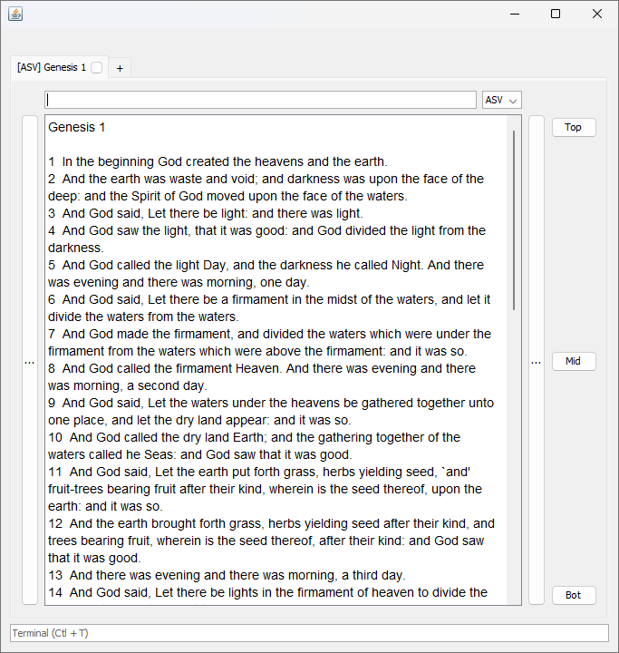
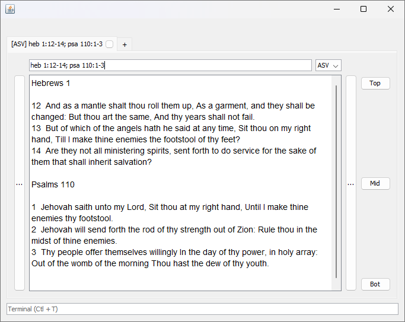
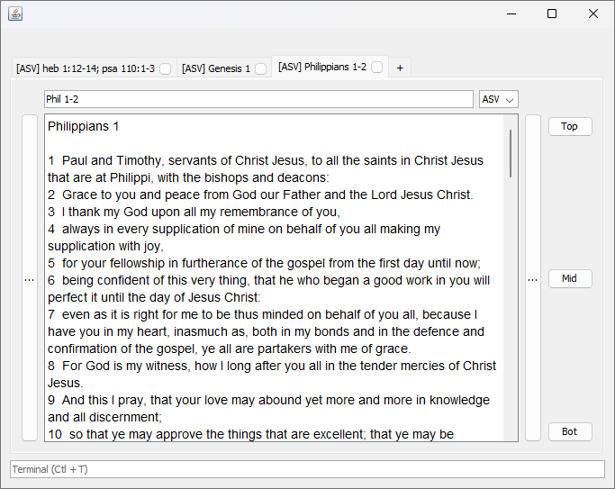

# Introduction
A simple Bible reader app written in Java, using JavaFX.

# Passage Search
Type an address, list of addresses, or address or verse ranges into the search (Find) bar and press Enter.

Tabbed browsing supported.

# Bible Versions
Only public-domain Bible versions are currently used.

- ASV
- YLT
- KJV

# Terminal
Not yet implemented.

